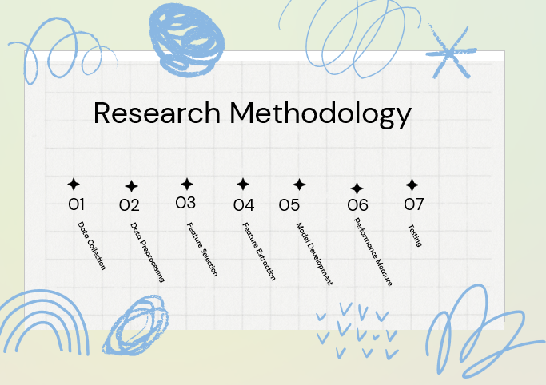
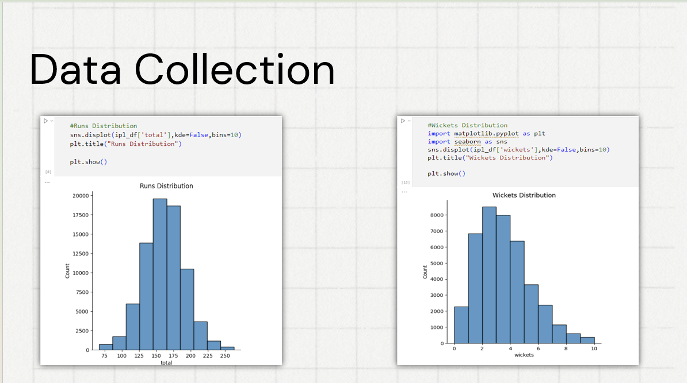
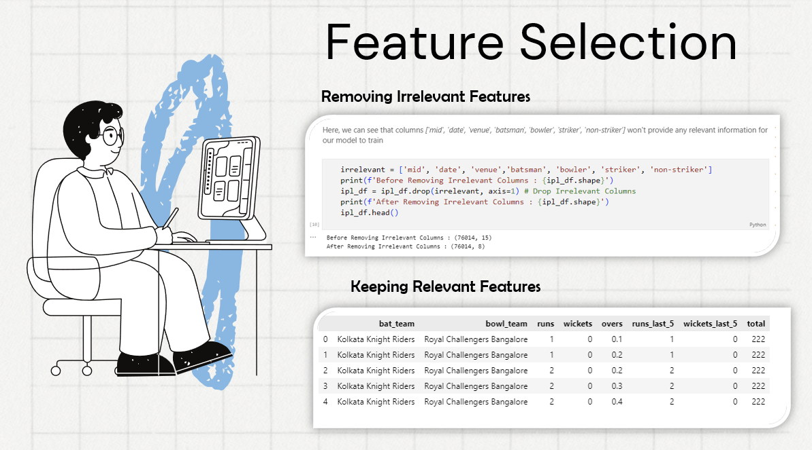
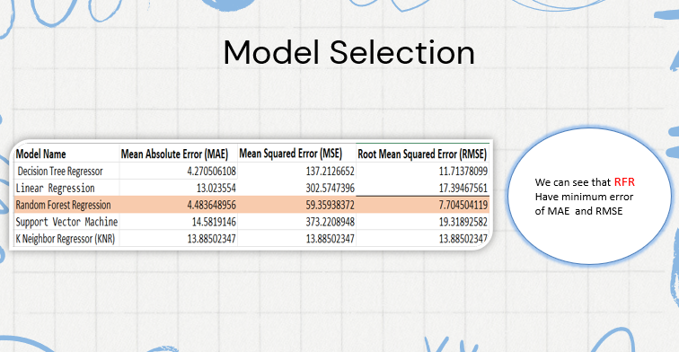
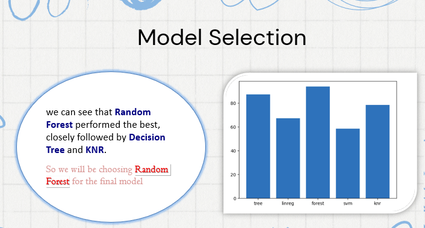
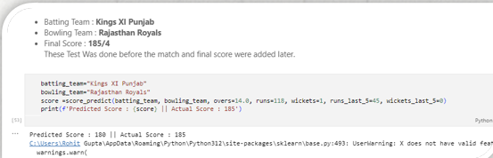

### **ML Project: IPL Score Predictor | Academic Project**  

- **Project Description**:  
   Created an IPL score predictor using machine learning models based on historical data and team performance.  

- **Key Contributions**:  
   - **Exploratory Data Analysis (EDA)**: Conducted comprehensive EDA to identify trends, patterns, and key performance indicators from the dataset.  
   - **Data Analysis**: Cleaned and processed data from Kaggle, engineered features, and performed exploratory analysis.  
   - Performed **model evaluation** using performance metrics such as accuracy, precision, recall, and F1-score to compare algorithm effectiveness.  
   - Achieved **90% accuracy** with ensemble models.  
   - Integrated **real-time data feeds** for live score updates.  

- **Technologies Used**:  
   - **Programming Language**: Python  
   - **Algorithms**: Decision Tree, Linear Regression, Random Forest, Support Vector Machine (SVM), K-Nearest Neighbors (KNN).  
   - **Libraries**: Pandas, Numpy, Sklearn, Matplotlib, Seaborn.

